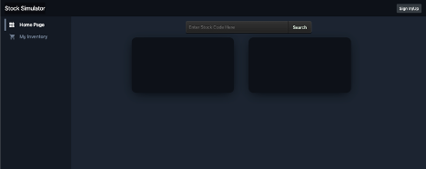
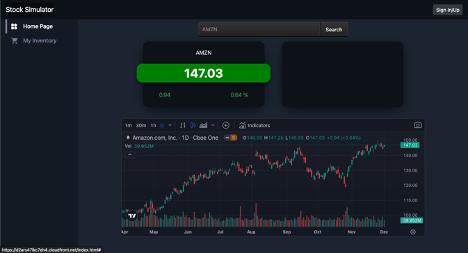
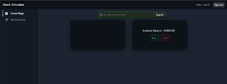
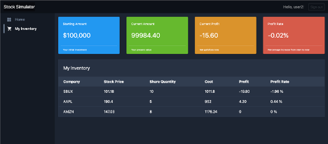

## Stock Trading Simulator

#### Introduction
The Stock Trading Simulator is a full-stack website designed to provide individuals with a risk-free environment to practice buying and selling stocks. 

In today's economy, where inflation can erode purchasing power, investing in stocks becomes essential for wealth protection and growth. However, many young individuals lack the financial resources to start investing. This simulator aims to bridge that gap by offering a tool for practicing stock trading without real money. Every user will get 10k at the beginning.

#### Solution Description:
- **Structure:** The web application follows a client-server architecture, with the front end interacting with the back end to handle user transactions and data storage.
- **Process Flow:** Users can access real-time stock prices, sign in to view their available balance and execute buy/sell transactions. The back-end server communicates with the database to update transaction records.
- **Front End:** The home page displays real-time stock prices, while the sign-in page allows users to access their account and perform transactions. The inventory page shows users' current holdings and calculates reward rates based on stock prices.
- **Back End (Server):** Express.js is used to build the server, handling client requests and routing them to appropriate actions.
- **Database:** MySQL is utilized to store user transaction information, including user data, inventory, and transaction records.

#### Result:
**Successes:** The project successfully achieves its main goal of providing users with a platform to practice stock trading with real-time data without using real money. Users can store transaction data and track their portfolio performance.
**Limitation:** The current version relies on free APIs for stock information, limiting additional features such as earnings reports and financial factors.
 
#### Conclusions:
**Design Choices:** Using JavaScript for both front-end and back-end development proved effective, while AWS deployment provides scalability and management benefits. Future improvements may include implementing more features for strategy testing and integrating CI/CD for project optimization.

#### Future Work:
Continued development aims to enhance filtering capabilities, import actual stock inventory, and implement CI/CD for project updates and optimization.

#### Demo Images:

*Home Page (without the user logging in)*
On the home page, before the user signs in, it can only be used to look up the real-time stock price. It will display the current price and the change after the last closing price.

*Search current stock price*

*Sign-in/up UI (AWS Cognito default UI)*

*Home page (after logging in)*
Once the user logs in, it will show the user's available balance and the buy/sell buttons. Users can buy or sell the select symbol by querying the stock information. Users can buy with enough available balance and sell with enough inventory.

*Buy/Sell functionality*
Users can make a new transaction, the browser will send the request to the back-end server, and the server will communicate with the database to update the transaction table.

*Inventory Page*
On the inventory page, the browser will request the server to ask for the inventory data with the user ID. Before displaying it on the web page, it will also calculate the reward rate based on the current stock price. 
